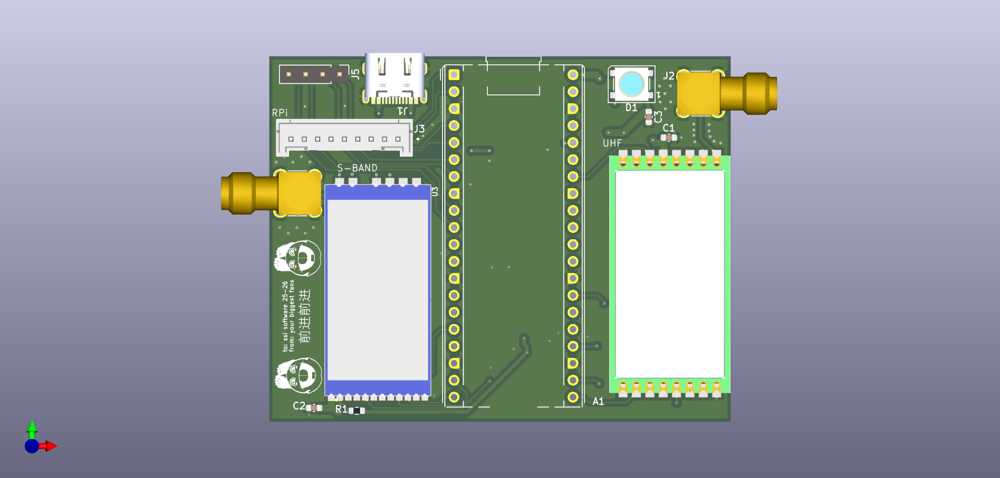

# Software Debug Pico Hat

A simple breakout board for the Raspberry Pi Pico, designed for S-Band and UHF LORA modules. It also includes exposed gpio pins for connection to other boards within the Samwise avionics stack.

[View Schematic PDF](Plots/SoftwareDebugPicoHat.pdf)

## Power

The S-Band and UHF LoRa radio modules require more power than the Raspberry Pi Pico can supply. Therefore, to use the radios, you must provide external power through the onboard USB-C connector.

## Pinout

This board connects to a Raspberry Pi Pico and provides the following pinouts:

### Raspberry Pi Communication
| Pin | Function      | Pico Pin |
|-----|---------------|----------|
| 0   | RPI_TX        | GP0      |
| 1   | RPI_RX        | GP1      |
| 2   | RPI_ENABLE    | GP2      |
| 3   | RPI_RESET     | GP3      |

### ACDS Communication
| Pin | Function      | Pico Pin |
|-----|---------------|----------|
| 4   | ACDS_TX       | GP4      |
| 5   | ACDS_RX       | GP5      |

### S-Band Module (LORA1280F27-TCXO)
| Pin | Function      | Pico Pin |
|-----|---------------|----------|
| 8   | SBAND_RST     | GP8      |
| 9   | SBAND_BUSY    | GP9      |
| 10  | SBAND_TXEN    | GP10     |
| 11  | SBAND_RXEN    | GP11     |
| 12  | SBAND_MISO    | GP12     |
| 13  | SBAND_CS      | GP13     |
| 14  | SBAND_SCK     | GP14     |
| 15  | SBAND_MOSI    | GP15     |
| 20  | SBAND_D1      | GP20     |

### UHF LORA Module (RFM98PW)
| Pin | Function      | Pico Pin |
|-----|---------------|----------|
| 16  | UHF_MISO      | GP16     |
| 17  | UHF_CS        | GP17     |
| 18  | UHF_SCK       | GP18     |
| 19  | UHF_MOSI      | GP19     |
| 20  | UHF_RST       | GP21     |
| 28  | UHF_D0        | GP28     |

### Miscellaneous
| Pin | Function      | Pico Pin |
|-----|---------------|----------|
| 26  | NEOPIXEL      | GP26     |
| 6   | MISC          | GP6      |
| 7   | MISC          | GP7      |
